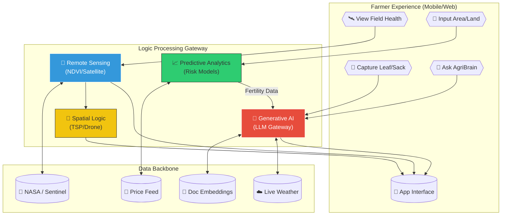

# System Architecture & Technical Ecosystem

This flowchart illustrates the multi-dimensional data flow of **Agri Shokti**, showing how Generative AI, Predictive Analytics, and Remote Sensing work together.

## Comprehensive Logic Flow (n8n Style)

## The Four Intelligence Hubs

1.  **Generative AI Hub**: Powered by Gemini 2.5 Flash. It provides the "human-to-machine" interface, translating technical knowledge into actionable Bengali advice.
2.  **Predictive Hub**: Uses mathematical models for NPK nutrient balancing, diesel fuel optimization, and harvest risk scores based on live weather deltas.
3.  **Sensing Hub**: Converts raw satellite spectral data from NASA/Sentinel into simplified health scores (NDVI), allowing farmers to "see" crop stress before it's visible to the naked eye.
4.  **Spatial Hub**: Optimizes movement. Whether it's drone spray paths using TSP algorithms or calculating the most efficient harvest route across multiple land parcels.
