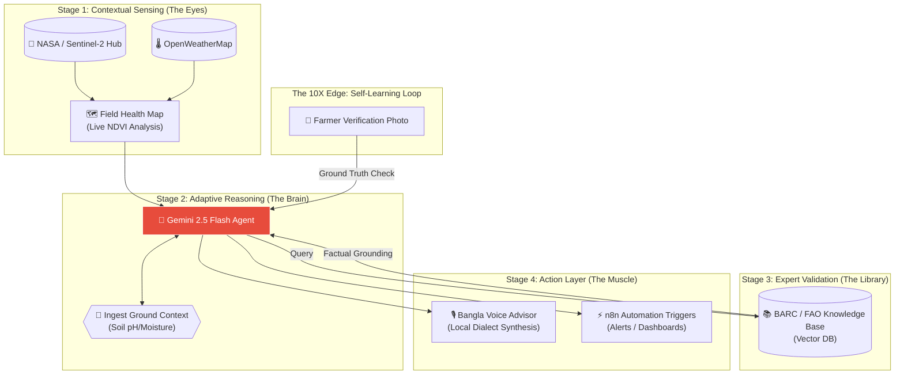

# Agri-Logic Pipeline: Comprehensive Architecture

This document serves as the official technical blueprint for **Agri Shokti**, designed to demonstrate high-level technical implementation and AI reasoning for the **MXB 2026** AgriTech judging committee.

---

## 1. The 4-Stage "Agri-Logic" Workflow
Our architecture implements a "Generational Leap" in agricultural advisory, moving from simple chatbots to a sensing-driven expert system.

---

## 2. AI Core: Multi-Agent Orchestration (MCP)
Agri Shokti employs a specialized **Model Context Protocol (MCP)** to coordinate various domain experts in parallel.

| Specialist Agent | Function | Source/API |
| :--- | :--- | :--- |
| **Geospatial Agent** | Processes Sentinel-2 imagery for crop stress zones. | Google Earth Engine |
| **Vision Agent** | Identifies pests/deficiencies in leaf photos. | Custom Multimodal Prompts |
| **Market Agent** | Analyzes live BDT price streams for selling windows. | Market-AI Service |
| **RAG Agent** | Performs semantic search against BARC guidelines. | Supabase pgvector |

---

## 3. Technology Stack Layering (Judge Overview)
Our stack bridges high-level satellite data with ground-level reality.

*   **Geospatial Layer**: Google Earth Engine, Sentinel Hub API, NASA SoilGrids.
*   **AI/ML Core**: **Gemini 2.5 Flash** (Orchestration), text-embedding-004.
*   **Backend & DB**: **Supabase** (PostgreSQL, pgvector, Edge Functions).
*   **Action Layer**: **n8n.io** (Workflow automation), Voice-first UI in **Bangla**.

---

> [!TIP]
> **Agricultural Consultant Analogy**: Think of our system as a highly skilled consultant. The satellite data is their **eyes**; the BARC database is their **library**; the LLM is their **brain**; and the localized voice-first UI is their **voice** used to speak to the farmer in their own language.
