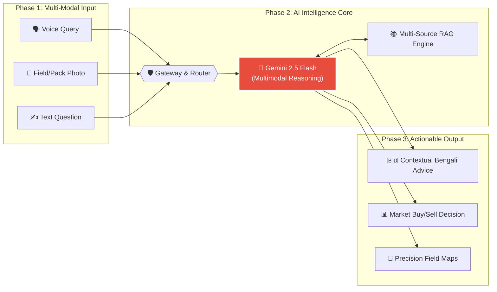
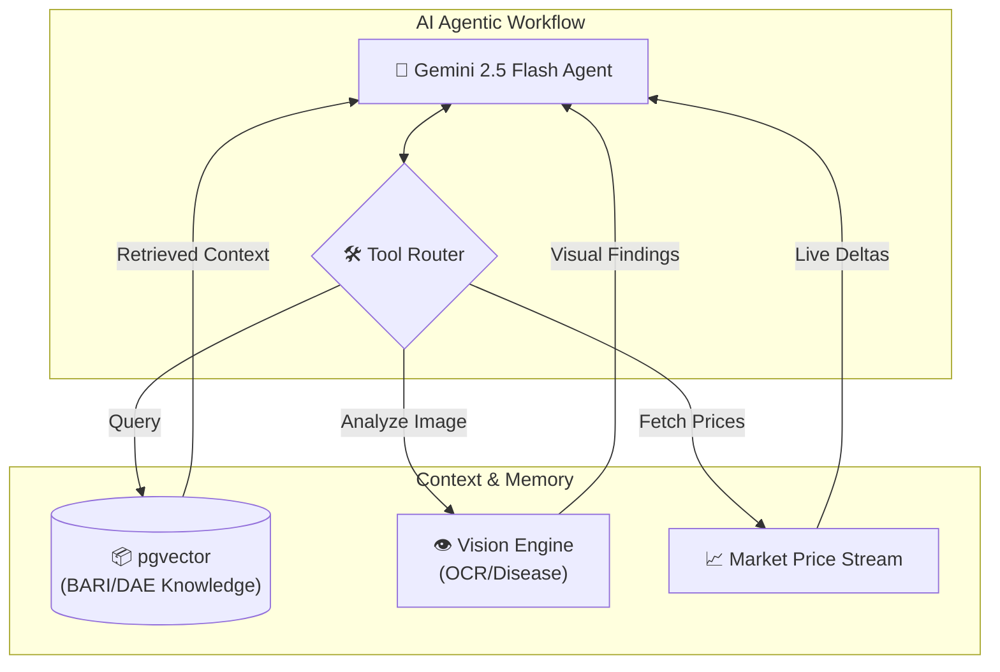
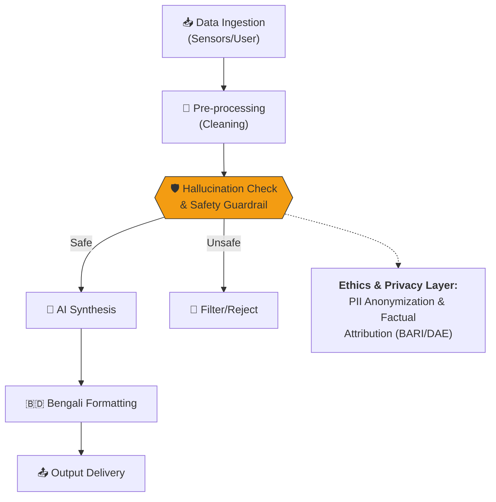

# Comprehensive System Architecture & Engineering Blueprints

This document serves as the official technical blueprint for **Agri Shokti**, designed to demonstrate high-level technical implementation and AI reasoning for the **MXB 2026** judging committee.

---

## 1. High-Level System Overview (The Big Picture)
Our architecture follows a clean **Input → Intelligent Logic → Output** paradigm, ensuring seamless interaction for rural farmers while maintaining high technical rigor.

---

## 2. AI Component Architecture (Internal Deep-Dive)
We integrate state-of-the-art AI-native tools and agentic workflows to handle the complexity of precision agriculture.

*   **Model Selection**: `google/gemini-2.5-flash` for high-speed multi-modal reasoning.
*   **RAG (Retrieval-Augmented Generation)**: Uses `text-embedding-004` to index 10k+ pages of BARI/DAE technical documentation into **Supabase pgvector**.
*   **MCP Style Integration**: Standardized Edge Functions act as tools for the model, allowing it to "sense" (Satellite), "analyze" (Market), and "see" (Vision).

---

## 3. Data Flow and Decision Logic
Judges can verify our **AI Reasoning** through these clear decision paths and safety guardrails.

### Decision Path Example (Pest Risk)
1.  **Ingestion**: Live humidity (>80%) and temp (28°C) data fetched via Weather API.
2.  **Processing**: Logic Engine identifies a high risk for *Rice Blast* fungus.
3.  **Cross-Verification**: RAG checks historical pest heatmaps in the same district.
4.  **Guardrail Layer**: If confidence is <70%, the system forces an "Expert Review Required" flag.

---

## 4. Technology Stack (Layered View)
Our stack is built for durability, scalability, and extreme performance.

| Layer | Technologies Used |
| :--- | :--- |
| **Frontend** | React, Vite, TailwindCSS (v0/Lovable optimized) |
| **Backend** | Supabase Edge Functions (Deno), Node.js, FastAPI |
| **Data Layer** | Supabase PostgreSQL, **pgvector**, NASA Satellite API |
| **AI/ML Layer** | **Gemini 2.5 Flash**, text-embedding-004, custom RAG |

---

> [!IMPORTANT]
> **MXB2026 Judge Note**: This diagram set illustrates the **foundations, wiring, and plumbing** of the Agri Shokti platform. Every AI-generated output is grounded in BARI research data with a traceable attribution log preserved in our `rag_interactions` table.
