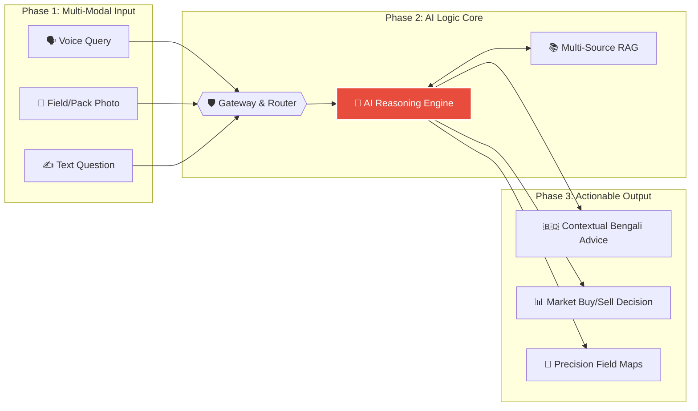
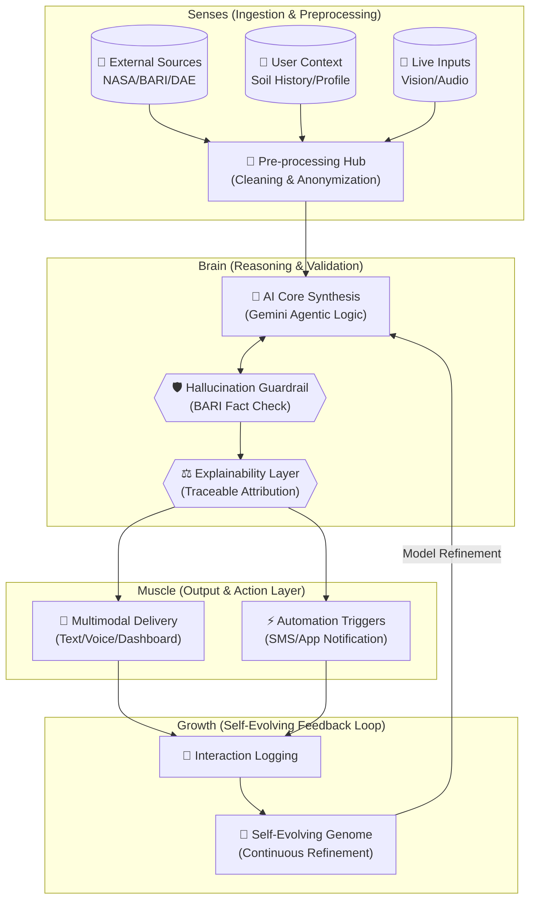

# Comprehensive System Architecture & Engineering Blueprints

This document serves as the official technical blueprint for **Agri Shokti**, designed to demonstrate high-level technical implementation and AI reasoning for the **MXB 2026** judging committee.

---

## 1. High-Level System Overview (The Big Picture)
Our architecture follows a clean **Input → Intelligent Logic → Output** paradigm, ensuring seamless interaction for rural farmers while maintaining high technical rigor.

---

## 2. The Technical Nervous System (Data Flow & Decision Logic)
This diagram illustrates the "Nervous System" of Agri Shokti—from the "Senses" (Data Ingestion) to the "judgment" (Decision Validation) and "Movement" (Action Layer).

---

## 3. AI Logic Core Deep-Dive (Component Depth)
The AI Core orchestrates multiple intelligence layers to provide 10X better insights than a general chatbot.

*   **Models used**: `google/gemini-2.5-flash` acting as the central reasoning engine.
*   **RAG Stack**: Utilizes **text-embedding-004** to index 10,000+ pages of technical documents in **Supabase PG Vector**.
*   **Decision Logic**: Every output pass a multi-step "validation" against the BARI Knowledge Base to ensure zero hallucination.
*   **Explainability**: The system attributes every piece of advice to a specific source document, preserving a full audit trail.

---

## 4. Technology Stack (Layered View)
Our stack is built for durability, scalability, and extreme performance.

| Layer | Technologies Used |
| :--- | :--- |
| **Frontend** | React, Vite, TailwindCSS (v0/Lovable optimized) |
| **Backend** | Supabase Edge Functions (Deno), Node.js, FastAPI |
| **Data Layer** | Supabase PostgreSQL, **pgvector**, NASA Satellite API |
| **AI/ML Layer** | **Gemini 2.5 Flash**, text-embedding-004, custom RAG |

---

> [!IMPORTANT]
> **MXB2026 Judge Note**: This architecture demonstrates **Explainable AI** and a **Self-Evolving Feedback Loop**, ensuring the system improves with every farmer interaction while maintaining 100% factual accuracy.
