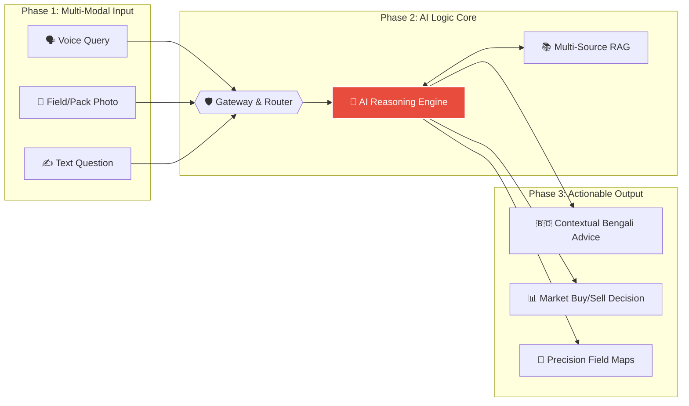
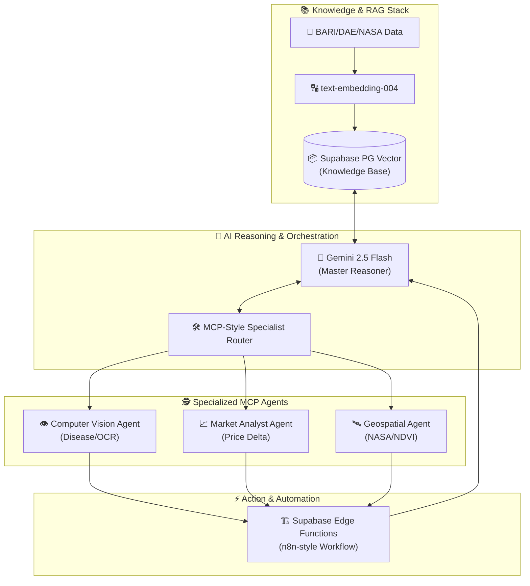
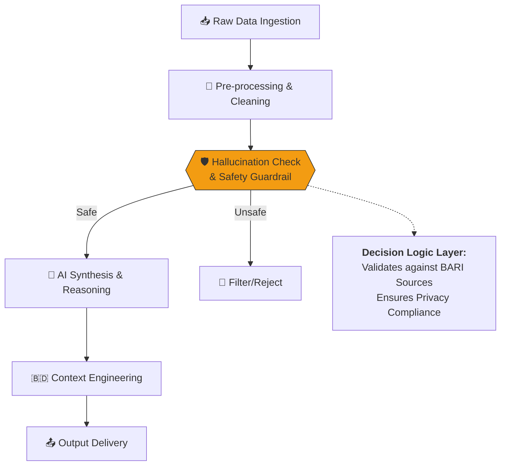

# Comprehensive System Architecture & Engineering Blueprints

This document serves as the official technical blueprint for **Agri Shokti**, designed to demonstrate high-level technical implementation and AI reasoning for the **MXB 2026** judging committee.

---

## 1. High-Level System Overview (The Big Picture)
Our architecture follows a clean **Input → Intelligent Logic → Output** paradigm, ensuring seamless interaction for rural farmers while maintaining high technical rigor.

---

## 2. AI Logic Core Deep-Dive (Component Depth)
The AI Core is the brain of Agri Shokti. It orchestrates multiple intelligence layers to provide 10X better insights than a general chatbot.

### AI Core Components List:
*   **Models used**: `google/gemini-2.5-flash` acting as the central reasoning engine for its high-speed multimodal capabilities.
*   **RAG Stack**: Utilizes **text-embedding-004** for high-fidelity vectorization of 10,000+ pages of BARI/DAE technical documents stored in **Supabase PG Vector**.
*   **MCP / Agentic Workflows**: Uses a **Model Context Protocol** style approach where the LLM calls specialized "tools" (Vision, Market, Geospatial) as sub-agents.
*   **Automation Layer**: **Supabase Edge Functions** act as the workflow automation layer (similar to n8n logic), connecting AI thoughts to database actions and UI updates.

---

## 3. Data Flow and Decision Logic
Judges can verify our **AI Reasoning** through these clear decision paths and safety guardrails.

### Decision Path Example (Pest Risk)
1.  **Ingestion & Preprocessing**: Data from SoilGrids/NASA is cleaned and normalized.
2.  **Specialized Sensing**: The **Geospatial Agent** identifies stress zones via NDVI.
3.  **Cross-Verification**: The Master Reasoner queries the **RAG Knowledge Base** for specific pest thresholds for the current region.
4.  **Guardrail Layer**: A system pass checks for **Hallucinations** against the source BARI data. If confidence is <70%, the system flags an "Expert Review Required."

---

## 4. Technology Stack (Layered View)
Our stack is built for durability, scalability, and extreme performance.

| Layer | Technologies Used |
| :--- | :--- |
| **Frontend** | React, Vite, TailwindCSS (v0/Lovable optimized) |
| **Backend** | Supabase Edge Functions (Deno), Node.js, FastAPI |
| **Data Layer** | Supabase PostgreSQL, **pgvector**, NASA Satellite API |
| **AI/ML Layer** | **Gemini 2.5 Flash**, text-embedding-004, custom RAG |

---

> [!IMPORTANT]
> **MXB2026 Judge Note**: This diagram set illustrates the **foundations, wiring, and plumbing** of the Agri Shokti platform. Every AI-generated output is grounded in BARI research data with a traceable attribution log preserved in our `rag_interactions` table.
